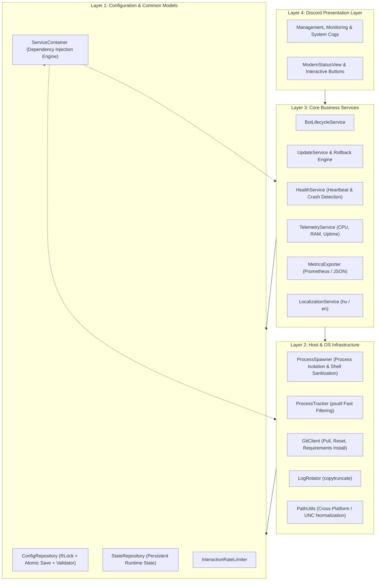

# FixItFixa - Autonomous Discord Bot Orchestration & Supervision Engine

[](https://python.org)
[](https://github.com/Rapptz/discord.py)
[]()
[-success.svg)]()
[](https://github.com/astral-sh/ruff)
[](https://mypy-lang.org/)
[](LICENSE)

**FixItFixa** is a resilient, enterprise-grade bot process orchestrator built in Python. Designed for reliability, observability, and seamless operational control, FixItFixa enables DevOps engineers and Discord server administrators to manage, monitor, update, and recover independent child bot processes in real time through an interactive Discord dashboard.

---

## Key Highlights

* **Clean 4-Layer Architecture & Dependency Injection**: Pure separation between Presentation (Discord UI), Domain Business Services, OS/System Infrastructure, and Configuration Repositories powered by a central `ServiceContainer`.
* **Zero-Disruption Process Lifecycle**: Gracefully starts, stops, reloads, and monitors background bot subprocesses across Windows and Linux environments without process leakage.
* **Hardened Security & Rate Limiting**: Built-in 4-tier Role-Based Access Control (RBAC), command injection sanitization (`shlex`), Git revision validation, and sliding-window interaction cooldowns.
* **Dual Observability & Prometheus Export**: Standard human-readable logs alongside structured single-line JSON logging (ELK / Loki / Datadog compatible), trace/correlation IDs (`contextvars`), and `/metrics` Prometheus endpoints.
* **Non-Locking copytruncate Log Rotator**: Real-time log file rotation that protects active child processes from file lock contention, accompanied by in-memory `io.BytesIO` Discord log streaming.
* **Enterprise Internationalization (i18n)**: Fully synchronized localization engine for Hungarian (`hu`) and English (`en`) with dynamic pluralization support.
* **Concurrency & Atomic File Persistence**: Thread-safe configuration and state management using `threading.RLock()` and crash-proof atomic file swaps (`.tmp` -> `fsync` -> `os.replace`).

---

## System Architecture



---

## Repository Layout

```
fixitfixa/
├── bot/                          # Layer 4: Discord Presentation & Cogs
│   ├── cogs/                     # Slash command endpoints (Management, Monitoring, System)
│   ├── ui/                       # Components V2, LayoutViews, and Embeds
│   ├── autocomplete.py           # Bot ID & dynamic autocomplete
│   ├── checks.py                 # RBAC permission decorators
│   └── client.py                 # BotManager Discord Gateway client
│
├── core/                         # Core Layers (1-3)
│   ├── common/                   # Enums, Constants, Icon Mappings, Rate Limiter, Retry decorators
│   ├── config/                   # Strongly-typed models, Config/State Repositories, Schema Validator
│   ├── interfaces/               # Formal Protocols & abstract service contracts
│   ├── services/                 # Business logic (Lifecycle, Updates, Health, Telemetry, i18n, Metrics)
│   ├── system/                   # Process Spawner, Tracker, Git Client, Log Rotator, Path Utils
│   ├── container.py              # Central Dependency Injection & Service Registry
│   ├── icons.py                  # Guild Emoji and Unicode symbol provider
│   └── logger.py                 # Dual text/JSON logger with Trace Context
│
├── locales/                      # Localized string resources
│   ├── hu.json                   # Hungarian translations & plurals
│   └── en.json                   # English translations & plurals
│
├── docs/                         # Developer documentation
│   ├── ARCHITECTURE.md           # Deep-dive architecture design guide
│   └── API_REFERENCE.md          # Technical component & API reference
│
├── tests/                        # 229+ unit and integration test suite
├── .github/workflows/ci.yml      # Multi-OS & multi-version CI pipeline
├── Dockerfile                    # Multi-stage slim container definition
├── docker-compose.yml            # Container orchestration manifest
├── pyproject.toml                # Project metadata, Ruff & Mypy configuration
├── requirements.txt              # Pinned production dependencies
└── manager.py                    # Application entrypoint
```

---

## Quickstart Guide

### Option A: Running with Docker (Recommended)

1. **Clone the repository**:
   ```bash
   git clone https://github.com/stargate91/discord-bot-manager.git
   cd fixitfixa
   ```

2. **Configure Environment Secrets**:
   ```bash
   cp .env.example .env
   ```
   Edit `.env` and set your Discord Bot token:
   ```env
   DISCORD_TOKEN=your_secret_bot_token_here
   ```

3. **Launch the Container**:
   ```bash
   docker compose up -d --build
   ```

---

### Option B: Local / Native Installation

1. **Prerequisites**: Python 3.10+ and Git.
2. **Setup virtual environment**:
   ```bash
   python -m venv .venv
   source .venv/bin/activate  # Linux / macOS
   # or
   .venv\Scripts\activate     # Windows
   ```
3. **Install Dependencies**:
   ```bash
   pip install -r requirements.txt
   ```
4. **Start FixItFixa**:
   ```bash
   python manager.py
   ```

---

## Configuration Reference (config.json)

FixItFixa is configured via `config.json` with strict schema validation on startup and save:

```json
{
    "settings": {
        "guild_id": "1083433370815582240",
        "access_control": {
            "roles": {
                "admin": "1486685311919460402",
                "tester": "1283594037802176546"
            },
            "channels": {
                "admin": "1486516075905417216",
                "public": "1486515344674787399"
            }
        }
    },
    "bot_settings": {
        "language": "hu",
        "command_prefix": "!",
        "command_suffix": "_fix",
        "log_default_lines": 50,
        "check_interval_seconds": 60,
        "status_refresh_seconds": 60,
        "status_recreate_minutes": 58,
        "git_branch": "origin/main",
        "bot_log_max_bytes": 10485760,
        "bot_log_backup_count": 3
    },
    "ui_settings": {
        "accent_color": 2829617,
        "items_per_page": 6
    },
    "bots": {
        "1353195232675926017": {
            "name": "Iris Watcher",
            "path": "/home/user/bots/watcher",
            "path_win": "E:\\projects\\bots\\watcher",
            "cmd": "/home/user/venv/bin/python bot.py",
            "cmd_win": "python bot.py",
            "log": "activity.log",
            "systemd_service": "watcher.service",
            "db_files": ["archive.db"]
        }
    }
}
```

---

## Role-Based Access Control (RBAC)

Commands and buttons enforce a 4-tier security boundary:

| Tier | Role | Scope & Permissions |
| :---: | :--- | :--- |
| **`BOSS`** | Server Owner / Administrator | Unrestricted access to all commands, sync, purge, and self-update across all channels. |
| **`MECHANIC`** | Admin Role (`admin_role_id`) | Full management (start, stop, restart, update, rollback, rotate logs) within the Admin Workshop channel. |
| **`INSPECTOR`** | Tester Role (`tester_role_id`) | Read-only inspection (live status cards, bot logs, public info). |
| **`EVERYONE`** | Server Member | Public ephemeral status overviews. |

---

## Command Summary

| Command | Min. Role | Description |
| :--- | :---: | :--- |
| `/restart bot_id:<ID>` | `MECHANIC` | Gracefully restart a managed bot subprocess. |
| `/update bot_id:<ID>` | `MECHANIC` | Fetch latest Git commits, install pip dependencies, and reload the bot. |
| `/rollback bot_id:<ID>` | `MECHANIC` | Revert bot repository to previous commit (`HEAD@{1}`) and restart. |
| `/logs bot_id:<ID> [lines:N]` | `INSPECTOR` | Stream the last N lines of a bot's log directly to Discord. |
| `/logs-rotate bot_id:<ID>` | `MECHANIC` | Rotate and archive a child bot's active log file. |
| `/manager-restart` | `MECHANIC` | Seamlessly restart FixItFixa without killing running child processes. |
| `/manager-update` | `MECHANIC` | Pull FixItFixa updates, reinstall requirements, and self-reload. |
| `/manager-logs` | `MECHANIC` | Fetch FixItFixa's central operational logs. |
| `/info [public:bool]` | `EVERYONE` | Display host CPU, RAM, Network speeds, and managed bot statuses. |
| `/sync [spec:scope]` | `BOSS` | Synchronize application slash commands with the Discord API. |

---

## Testing & Code Quality

FixItFixa comes with an extensive automated test suite covering unit logic, failure recovery, security sanitization, and full end-to-end pipelines.

```bash
# Run the complete test suite with coverage report
python -m pytest

# Run static type checking
mypy core bot

# Run code style & lint check
ruff check core bot tests
```

---

## Contributing & Guidelines

Contributions are welcome! Please check out [CONTRIBUTING.md](CONTRIBUTING.md) for our coding standards, branch conventions, and PR workflow, and inspect [CHANGELOG.md](CHANGELOG.md) for recent release history.

---

## License

This project is open source and available under the [MIT License](LICENSE).
