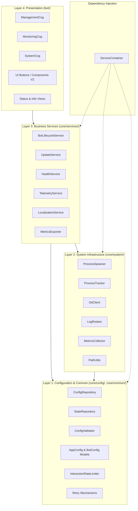

# FixItFixa System Architecture

FixItFixa is designed following the **Clean Architecture** paradigm, ensuring separation of concerns, testability, and independence from external frameworks (such as Discord API or host OS quirks).

---

## Architectural Layers

---

## 1. Presentation Layer (`bot/`)
* **`BotManager` (`client.py`)**: Responsible solely for Discord client connection, gateway events, command tree syncing, and presence updates.
* **Cogs (`cogs/`)**: Discord slash command and prefix router endpoints.
* **UI Views & Components (`ui/`)**: LayoutViews and interactive action buttons for user interactions.

## 2. Business Services Layer (`core/services/`)
* **`BotLifecycleService`**: Manages start, stop, restart, and synchronized multi-bot actions.
* **`UpdateService`**: Handles Git pulling, dependency installations, rollbacks, and process reloading.
* **`HealthService`**: Background process monitoring and automatic crash recovery callbacks.
* **`TelemetryService`**: Aggregates CPU, RAM, disk, network, and uptime metrics.
* **`LocalizationService`**: Pluralized, key-based multi-language string formatting.
* **`MetricsExporter`**: Generates Prometheus and JSON metric snapshots.

## 3. System Infrastructure Layer (`core/system/`)
* **`ProcessSpawner`**: Spawns isolated background processes (`CREATE_NEW_PROCESS_GROUP`) with shell injection prevention.
* **`ProcessTracker`**: Fast psutil process inspection and live PID tracking.
* **`GitClient`**: Subprocess Git operations with branch/ref security sanitization.
* **`LogRotator`**: Copytruncate log file archival without interrupting running bots.
* **`PathUtils`**: Cross-platform path equivalence, UNC share handling, and subpath validation.

## 4. Configuration & Common Layer (`core/config/`, `core/common/`)
* **`ConfigRepository` & `StateRepository`**: Thread-safe (`RLock`), atomic (`os.replace`) JSON storage.
* **`ConfigValidator`**: Pre-startup and pre-save schema validation.
* **`InteractionRateLimiter`**: Sliding-window cooldown protecting Discord buttons.
